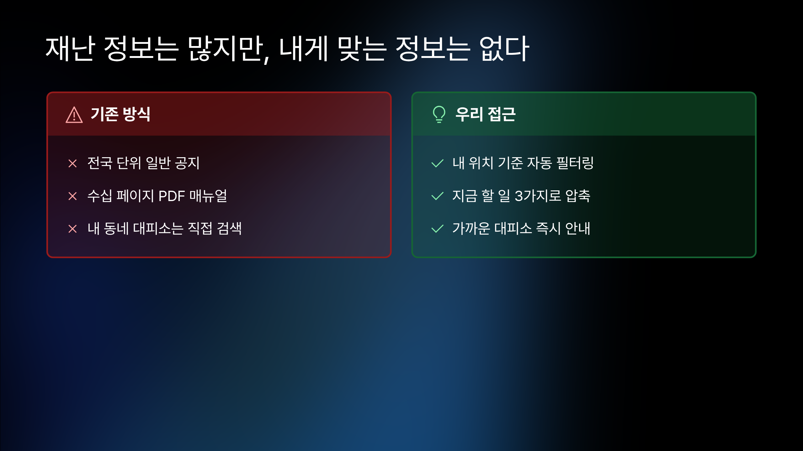
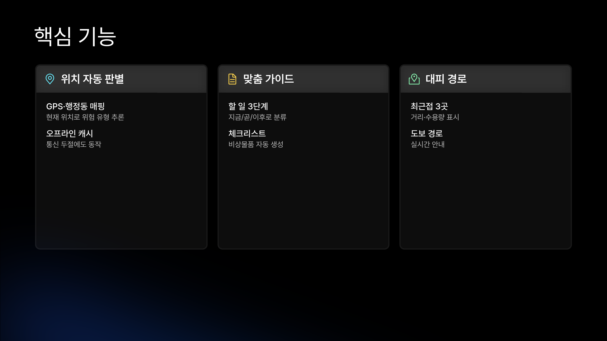
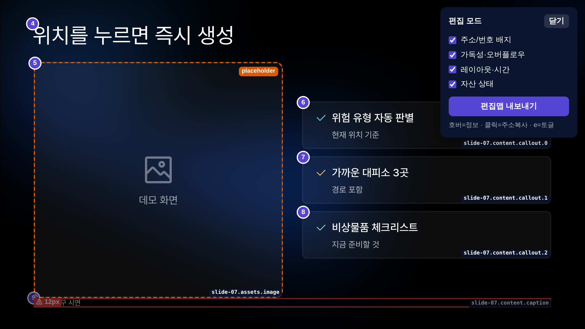

# 한국 공공 서비스 해커톤 스타터 키트

4시간 AI 해커톤에서 주제를 받자마자 "돌아가는 데모 + 발표"까지 만들기 위한 출발점입니다.

크게 두 가지로 이루어져 있습니다.

- **워크플로우 엔진** (`workflow/` + `CLAUDE.md`) — AI와 단계를 끊어가며 진행합니다.
- **키트 자산** — Next.js+KRDS 스택, 공공데이터, 발표 생성기. 매번 새로 만들 필요가 없습니다.

## 목차

- [1. 세팅](#1-세팅)
- [2. 워크플로우 한눈에](#2-워크플로우-한눈에)
- [3. 단계별 진행 (예시 주제)](#3-단계별-진행-예시-주제)
- [4. 발표](#4-발표)
- [5. 폴더 구조](#5-폴더-구조)
- [6. 키트 자산](#6-키트-자산)
- [7. 운영 원칙](#7-운영-원칙)
- [8. 라이선스와 출처](#8-라이선스와-출처)

---

## 1. 세팅

이 저장소는 **독립된 npm 프로젝트 3개**로 이루어져 있습니다 — 루트, `web/`, `presentation/slidev/`. 각각 한 번씩 `npm install`을 해주면 됩니다.

폰트·KRDS 토큰·발표 테마는 저장소에 이미 포함되어 있어 따로 받을 필요가 없습니다. 모든 스크립트는 윈도우·맥·리눅스에서 그대로 동작합니다(OS 전용 구문이나 하드코딩 경로 없음).

**필수 도구**

| 도구 | 요건 |
|---|---|
| Node.js | ≥ 18.18 (권장 20+) |
| Git | 클론·커밋 |
| 브라우저 | Chromium 계열(Chrome/Edge) — 발표·편집 오버레이 |

**설치 (3곳)**

| 위치 | 명령 | 용도 |
|---|---|---|
| 루트 | `npm install` | 워크플로우 엔진 도구 |
| `web/` | `npm install` | Next.js + KRDS 앱 |
| `presentation/slidev/` | `npm install` | 슬라이드 렌더·프리뷰 |

설치한 뒤 `npm run workflow:status`로 현재 단계를 확인합니다.

**키 (`.env.local`에만 두고, 커밋 금지)**

| 키 | 언제 필요 |
|---|---|
| 카카오맵 JS 키 | 지도를 쓸 때. 도메인 등록까지 해야 하므로 대회 전에 미리 발급 |
| data.go.kr 서비스키 | 공공 API를 쓸 때. 활용신청도 미리 |
| LLM API 키 | 앱이 런타임에 LLM을 호출할 때(없으면 fixture로 대체) |

슬라이드 자동 캡처(`npm run presentation:capture`)를 쓰려면 Playwright와 Chromium이 추가로 필요합니다.

```bash
npm i -g playwright && npx playwright install chromium
```

설치하지 않아도 그냥 건너뛰므로 발표에는 지장이 없습니다. 또한 `data.go.kr`이나 일부 CDN이 막힌 환경이 있어, 데이터는 항상 fixture(샘플 JSON) 폴백을 함께 둡니다.

---

## 2. 워크플로우 한눈에

전체 과정을 13단계로 나눕니다. 각 단계가 하는 일은 네 가지뿐입니다.

> 현재 단계 지침만 읽기 → 그 단계 작업만 하기 → Gate(검증) 통과 → 다음

앞 단계를 미리 당겨와 한꺼번에 처리하지 않습니다. 4시간 해커톤이 가장 흔하게 무너지는 지점이기 때문입니다.

"지금 몇 단계인지"는 사람이 외울 필요가 없습니다. `workflow/state.yaml`이 현재 위치를 들고 있고, `CLAUDE.md`(라우터)가 AI를 현재 단계 문서로 안내합니다.

시간이 모자라면 단계를 건너뛰지 않습니다. 대신 **만들 기능의 범위를 줄입니다.**

각 단계에서 채워지는 계약 문서는 역할이 분리되어 있습니다(같은 내용 중복 금지).

| 파일 | 내용 | 생성 |
|---|---|---|
| `concept.md` | 방향 — 한 문장 피치·Wow·마지막 문장 | Stage 02 |
| `spec.md` | 데모 약속 — 시나리오·Wow Moment | Stage 03 |
| `plan.md` | 구현 체크리스트 — 작업분해·폴백·파일 소유권 | Stage 04 |
| `implementation/manifest.json` | 실제로 만든 기능 — 발표는 이 범위만 다룸 | Stage 05 |

---

## 3. 단계별 진행 (예시 주제)

예시 주제를 하나 두고 설명하겠습니다: **"동네별 폭염 행동 가이드"** (대상: 독거노인·야외근로자).

각 단계의 입력 → 작업 → 결과물은 다음과 같습니다.

| # | 단계 | 입력 | 핵심 작업 | 결과물 | Gate |
|---|---|---|---|---|---|
| 00 | intake | 주제·마감·발표시간 | 주제·제약 등록, 키트·네트워크 점검 | `state.yaml` 초기화 | 체크리스트 |
| 01 | 리서치 | 주제 | 서브에이전트 병렬 탐색(아래 3.1) | `research/*.md` + 통합 | 체크리스트 |
| 02 | 인사이트 선택 | 리서치 | 후보 도출, 방향 합의(아래 3.1) | `concept.md` | 체크리스트 · **승인** |
| 03 | spec | concept | 데모 시나리오 확정(위치 허용 → 위험도 → 행동 3단계 → 가까운 쉼터), Wow Moment 명시 | `spec.md` | **실행** |
| 04 | plan | spec | 작업 분해(지도·위치판정·가이드생성·쉼터매칭), 폴백·소유권 정의 | `plan.md` | 체크리스트 |
| 05 | 구현 | plan | 기능 구현(독립 파일이면 병렬, 작으면 단독). 만든 것만 manifest에 기록 | `web/` 코드 · `manifest.json` | **실행(build)** |
| 06 | 통합 | 05 결과 | 합치고 깨진 부분 수정 | 동작하는 앱 | 체크리스트 |
| 07 | 데모 검증 | 앱 | 시나리오대로 실제 동작 확인 + 화면 캡처 | 시나리오 통과 · `output/captures/` | **실행(demo)** |
| 08 | 스크립트 | concept·manifest·캡처 | 발표 대본(시간 배분, 데모+킥 ≥50%) + 예상 Q&A | `script.md` · `qna.md` | 체크리스트 |
| 09 | 발표 생성 | script | `deck.json` 작성(16 레이아웃에서 선택) → Slidev·Notion 렌더 | `deck.json` · `slides.md` · `presentation.html` | **실행(generation)** |
| 10 | 발표 검증 | 슬라이드 | 캡처 보고 넘침·작은 글씨·시간 점검 → `contentScale` 조정 | 캡처 · `validation-report.md` | **실행(visual)** |
| 11 | 리허설 | 발표물 | 시간 맞춰 리허설, 최종 점검 | 확정 발표물 | 체크리스트 · **승인** |
| 12 | 패키지 | 전체 | 제출물 정리(출처·라이선스 기록) | 제출 패키지 | 체크리스트 |

- **승인 단계(02·11)** — AI가 임의로 정하지 않고 멈춰 사용자 승인을 받습니다. 승인 전에는 확정 파일을 만들지 않습니다.
- **실행 Gate(03·05·07·09·10)** — 실제 코드로 검사합니다. 나머지는 "필요한 파일이 있는지 + 자가점검" 체크리스트입니다.
- **한 단계 진행 절차** — 지침 읽기 → (필요하면 서브에이전트 병렬) → 결과 통합 → `npm run gate:<stage>` → `npm run workflow:handoff` → `npm run workflow:complete`. 막히면 `npm run workflow:fail "<사유>"`로 기록합니다. 새 세션은 `npm run workflow:resume`으로 이어갑니다.

### 3.1 기획이 가장 중요합니다 (Stage 01·02)

기능을 하나 더 붙이는 것으로는 기억에 남지 않습니다. **문제를 남들과 다르게 보는 것**이 차별화를 만듭니다. 그래서 리서치·인사이트 두 단계에 특히 공을 들입니다. (자세한 기준은 `docs/AI_Hackathon_Operating_System.md` §4–5에 있습니다.)

**Stage 01 — 병렬 리서치**

5개 트랙을 서브에이전트가 동시에 조사하고, 각자 보고서를 남깁니다. 메인이 이를 통합합니다.

넓게 훑을수록 좋은 인사이트가 나오므로, 이 단계만큼은 혼자 좁게 파지 않고 병렬로 진행합니다.

| 트랙 | 보는 것 | 결과물 |
|---|---|---|
| A 사용자 문제·JTBD | 사용자·상황·지금 방식이 실패하는 이유·그 비용 | `research/jtbd.md` |
| B 국내 사례 | 이미 있는 기능·공공/민간 차이·사용자 마찰·규제·겹칠 위험 | `research/domestic.md` |
| C 해외 사례 | 실제 사례 3개 이상 + 가져올 수 있는 메커니즘 | `research/overseas.md` |
| D 데이터·구현 현실성 | 쓸 수 있는 데이터·4시간 내 구현 가능성 | `research/feasibility.md` |
| E 심사위원 관점·차별화 | 누구나 할 법한 접근·화려하지만 약한 방향·우리 차별점 | `research/judge-review.md` |
| 통합 | 위를 합친 결정용 요약 | `research/integrated-findings.md` |

서브에이전트 보고서는 사용자가 직접 열어볼 수 있도록 파일로 남기고, 메인은 통합한 요약을 말로 풀어 설명합니다(파일만 남기고 끝내지 않습니다).

**Stage 02 — 인사이트 선택 (사용자 승인)**

리서치에서 인사이트 후보를 **5개 이상** 만들어 평가하고, 쓸 만한 방향 2–3개로 추려 사용자에게 제시합니다. 승인된 방향만 `concept.md`(북극성)로 확정하며, 승인 전에는 확정하지 않습니다.

좋은 인사이트는 다음 흐름을 따릅니다.

```text
흔한 전제 → 실제 현실 → 둘 사이 모순 → 관점 재정의
```

폭염 주제로 예를 들면 다음과 같습니다.

```text
전제   : 폭염엔 경보·정보를 더 많이 보내야 한다
현실   : 정보는 이미 넘치는데 독거노인·야외근로자는 정작 움직이지 않는다
모순   : 같은 경보가 모두를 똑같이 움직이게 하지는 못한다
재정의 : 폭염은 '정보 부족'이 아니라 '취약계층이 행동으로 옮기느냐'의 문제다
```

이 재정의 한 줄이 나머지를 모두 바꿉니다 — 타깃, 솔루션, 데모 장면, 발표 메시지까지.

반대로 "AI로 더 편리하게", "정보를 한곳에 모으기", "맞춤형 서비스"는 인사이트가 아닙니다. 솔루션이거나 효과일 뿐입니다.

후보는 7가지로 평가합니다 — 새로움·설득력·근거·AI 연결성·시연 가능성·4시간 구현 가능성·위험한 전제 여부.

---

## 4. 발표

### 4.1 발표 순서 (실제 말하는 순서)

심사위원은 30초 안에 판단하며, 발표를 굳이 이해하려 애쓰지 않습니다. 그래서 **결론부터 제시합니다.** 결과를 먼저 보여주고, 그다음 문제·인사이트로 "왜 이것이 맞는지"를 뒷받침한 뒤, 데모로 실제 동작을 증명하고, 마지막 한 문장으로 마무리합니다.

설명을 차례로 쌓아 결론에 도달하는 구조는 사용하지 않습니다. (`docs/AI_Hackathon_Operating_System.md` §7 기준)

| 순서 | 비트 | 슬라이드(semantic) |
|---|---|---|
| 1 | **Answer First** — 누구에게 무엇을 어떻게 해결하는지 한 문장 | hero |
| 2 | Problem — 사용자·상황·지금 방식의 실패·그 비용 | problem-flow |
| 3 | Insight — 문제를 다르게 보는 관점 | insight-statement / contrast |
| 4 | Solution — 핵심 기능 | product-overview |
| 5 | **Demo (+ Wow Moment)** — 실제로 동작한다는 증거 | demo-callout / demo-fullscreen |
| 6 | Mechanism — 어떻게 동작하는가 | architecture |
| 7 | Impact — 효과(숫자·전후) | big-number / before-after |
| 8 | Limitation / Guardrail — 한계와 안전장치 | limitation-guardrail |
| 9 | Expansion — 확장 방향(선택) | expansion-map |
| 10 | **Closing** — 기억에 남을 한 문장 | closing |

**시간 배분 (5분 기준):** Answer+Problem 40–50초 · Insight+Solution 40–50초 · **Demo+Wow 최소 2분** · Mechanism 20–30초 · Impact+Guardrail 30–40초 · Closing 15–20초.

원칙은 다음과 같습니다.

- **결론부터** — 첫 30초 안에 "왜 필요한지"가 전달되어야 합니다.
- **데모에 절반 이상** — 결국 "실제로 동작한다"가 가장 강한 설득입니다. Wow 장면은 화면으로 확인되는 형태여야 합니다.
- **만든 것만 말하기** — `manifest.json`에 implemented(또는 허용된 mocked/fallback)로 없는 기능은 단정적으로 말하지 않습니다.
- **한 문장으로 마무리** — Closing은 `concept.md`의 마지막 문장을 그대로 사용합니다.

이 10개 비트가 16개 레이아웃과 짝을 이루므로, `deck.json`은 각 비트에 맞는 레이아웃만 골라 사용합니다.

**생성 예시 (실제 Slidev 출력)**



*문제 vs 해법 비교 — `contrast` 레이아웃. 색 패널로 대비를 보여줍니다.*



*핵심 기능 — `product-overview` 카드 그리드. 카드가 높이를 채워 화면이 꽉 찹니다.*



*`?edit=1` 편집 모드 — 칸마다 주소·번호가 표시됩니다. "이 칸(`slide-07.content.callout.0`)을 고쳐줘"라고 하면 그 자리만 수정합니다. placeholder·⚠ 경고도 함께 보여주며, 발표 모드에서는 모두 사라집니다.*

### 4.2 발표 만들기 (Stage 08–10)

- **08 스크립트** — 위 순서대로 대본·시간 배분·예상 Q&A를 먼저 확정합니다. 슬라이드는 이 대본을 시각화한 것일 뿐입니다.
- **09 생성 — "무엇을 담을지"와 "어떻게 그릴지"를 분리합니다.**
  - `deck.json` 한 파일만 AI가 작성합니다 → 무엇을 담을지(판단)
  - 렌더는 스크립트가 자동으로 처리합니다 → 어떻게 그릴지(변환)
  - 같은 `deck.json`에서 결과물 두 개가 동시에 나옵니다:
    - **Slidev** — 기본 발표 매체. 라이브 렌더·글로우 배경·클릭 단계를 지원합니다.
    - **Notion HTML** — 백업. 파일 하나라 오프라인·네트워크 차단 환경에서도 열립니다.
  - 소스가 하나이므로 발표물을 두 번 만들 필요가 없습니다.
- **수정은 편집 오버레이로** — 발표 주소 뒤에 `?edit=1`을 붙이면 칸마다 주소·번호가 표시됩니다(위 이미지). 주소로 칸을 지정하면 `deck.json`의 해당 필드만 고쳐 다시 렌더합니다. Slidev와 Notion이 같은 주소 규약을 사용합니다.
- **10 검증 — 캡처로 확인합니다** — 슬라이드를 PNG로 캡처해 글자 넘침·작은 글씨·발표 시간을 점검하고, `contentScale`(0.5–2)로 키우거나 줄입니다.

| 명령 | 동작 |
|---|---|
| `npm run presentation:build` | deck 검증 → Slidev·Notion 동시 생성 → 정합 검증 (한 번에) |
| `npm run presentation:capture` | 슬라이드 PNG 캡처(기본 Slidev, 폴백 Notion) |
| `cd presentation/slidev && npm run build` | 발표용 Slidev 빌드 |

---

## 5. 폴더 구조

```
CLAUDE.md          AI용 라우터 — 작업 시작 시 먼저 읽음
concept/spec/plan.md, PROGRESS.md   계약서(단계 결과물)

workflow/          워크플로우 엔진
  state.yaml         현재 단계/상태(머신이 읽는 현재 위치)
  stages.yaml        단계 ↔ 지침파일·Gate 매핑
  stages/00..12.md   단계별 상세 지침
  gates/             Gate 검증 스크립트 + cross-review
  scripts/           상태 전환 도구(status/start/complete/handoff/resume/fail)
  templates/, contracts/, history/, decisions/

presentation/      발표 생성
  deck.json          발표 단일 계약(AI가 작성)
  generator/         deck.json → Slidev/Notion 렌더러·검증·캡처
  slidev/            Slidev 프로젝트(global-top.vue = 편집 오버레이)
  theme/             Notion 정적 HTML 테마 + 편집 오버레이
  output/            렌더 결과물

web/                Next.js + KRDS 스캐폴드
data/               공공데이터(경계·대피소) + data-sources.md
design/krds/        KRDS 디자인 토큰·엠블럼
docs/               운영 지침 문서 + images/
research/           Stage 01 리서치 보고서
examples/           참고 완성본
implementation/     manifest.json(실제 만든 기능)
```

---

## 6. 키트 자산

| 묶음 | 내용 |
|---|---|
| 웹 스택 | `web/` — Next.js 14 + React 18 + TS + Tailwind + KRDS (`install`+`build` 통과) |
| 공공데이터 | `data/` — 전국 시도/시군구 경계, 시도→시군구 매핑, 민방위 대피소 약 17,000곳 |
| 디자인 | `design/krds/` — KRDS 공식 토큰(CSS/JSON/Figma) + 정부 엠블럼 |
| 재사용 코드 | 카카오맵 컴포넌트, 위치/거리 유틸, 공공 CSV 변환 스크립트 |
| 참고 완성본 | `examples/disaster-guide/` — 연습 결과물 소스 |
| 운영 지침 | `docs/` — 기획 품질 기준, 발표 생성 가이드, 엔진 구조, 도메인 데이터 준비 |

재사용 방법은 `docs/kit-assets.md`에 정리되어 있습니다(KRDS 함정, 카카오 키, `data.go.kr` 차단 대응 포함).

주제가 공공·지역과 무관하다면 워크플로우 + `web/` 스캐폴드 + 발표 파이프라인만 사용하고, KRDS·공공데이터는 제외하면 됩니다.

---

## 7. 운영 원칙

- 현재 단계 밖의 일을 미리 진행하지 않습니다. 전체를 한 번에 처리하려 하지 않습니다.
- Gate를 실행하지 않고 완료 처리하지 않습니다. 실패를 성공으로 기록하지 않습니다.
- 승인 단계(02·11)에서 임의로 선택하지 않습니다.
- `manifest.json`에 없는 기능을 발표에서 단정하지 않습니다. 근거 없는 수치를 만들지 않습니다. mocked/fallback을 실시간처럼 표현하지 않습니다.
- 시간이 부족하면 단계를 생략하지 말고 기능 범위를 줄입니다.
- 메인 전용 파일은 서브에이전트가 수정하지 않습니다 — `state.yaml`·`stages.yaml`·`spec.md`·`plan.md`·`PROGRESS.md`·`README.md`·루트 `package.json`·공통 설정/Schema.

---

## 8. 라이선스와 출처

KRDS 이용약관 · `@krds-ui/core`(Apache-2.0) · 공공데이터포털을 따릅니다. 발표 엔진은 BaizeAI/talks(Apache-2.0)의 카드 디자인을 이식했습니다.

자세한 출처는 `design/krds/SOURCE.md`, `data/data-sources.md`, `presentation/sources/`에 있습니다.
